<!--

Eclipse Tractus-X - Software Development KIT

Copyright (c) 2025 LKS Next
Copyright (c) 2025 Contributors to the Eclipse Foundation

See the NOTICE file(s) distributed with this work for additional
information regarding copyright ownership.

This work is made available under the terms of the
Creative Commons Attribution 4.0 International (CC-BY-4.0) license,
which is available at
https://creativecommons.org/licenses/by/4.0/legalcode.

SPDX-License-Identifier: CC-BY-4.0

-->
# SDK Structure and Components

The Eclipse Tractus-X SDK follows a **modular architecture** that provides clean separation of concerns and maximum flexibility for dataspace application development.

## Overview

The SDK is organized into three main libraries, each serving distinct purposes:

<div class="grid cards" markdown>

-   :material-database:{ .lg .middle } **Dataspace Library**

    ---

    Core connector services and Eclipse Tractus-X Connector integration for basic dataspace operations.

    [:octicons-arrow-right-24: Learn more](../../api-reference/dataspace-library/index.md)

-   :material-factory:{ .lg .middle } **Industry Library**

    ---

    Digital Twin Registry and Submodel Server integration for industry-specific data models and standards.

    [:octicons-arrow-right-24: Learn more](../../api-reference/industry-library/dtr/services.md)

-   :material-puzzle:{ .lg .middle } **Extensions Library**

    ---

    Use case-specific extensions and add-on functionality for custom business logic implementations.

    [:octicons-arrow-right-24: Learn more](../../api-reference/extension-library/semantics/semantics.md)

</div>

## Architecture Layers

The SDK implements a **layered architecture** that promotes clean code organization and maintainability:

```mermaid
graph LR
    A["🎯 Your App"] --> B["📋 Services"]
    B --> C["🎮 Controllers"]
    C --> D["🔌 Adapters"]
    D --> E["🌐 EDC Connector"]
    
    style A fill:#e1f5fe
    style B fill:#f3e5f5
    style E fill:#e8f5e8
```



## Library Structure

### 1. Dataspace Library (`tractusx_sdk.dataspace`)

The foundation layer for all dataspace interactions:

```
tractusx_sdk/dataspace/
├── adapters/          # HTTP communication adapters
│   └── connector/     # Connector-specific adapters
├── controllers/       # API request handlers
│   └── connector/     # Connector API controllers
├── managers/          # Authentication and connection management
│   └── connection/    # Connection lifecycle management
├── models/            # Data models and schemas
│   ├── connection/    # Connection-related models
│   └── connector/     # Connector data models
├── services/          # High-level business logic
│   ├── connector/     # Connector service implementations
│   └── discovery/     # Discovery service integrations
└── tools/             # Utility functions and helpers
```

**Key Components:**

- **Service Factory** - Creates connector services with proper configuration
- **Base Connector Service** - Core abstraction for EDC connector interactions
- **Connection Managers** - Handles connection lifecycle and authentication
- **HTTP Adapters** - Low-level HTTP communication with connectors
- **Discovery Services** - Dataspace discovery and catalog operations

### 2. Industry Library (`tractusx_sdk.industry`)

Specialized components for industry-specific use cases:

```
tractusx_sdk/industry/
├── adapters/          # Industry-specific adapters
│   └── submodel_adapters/  # Submodel service adapters
├── models/            # Industry data models
│   ├── aas/          # Asset Administration Shell models
│   └── v3/           # Version 3 specific models
└── services/          # Industry services
    └── discovery/     # Industry discovery services
```

**Key Features:**

- **Digital Twin Registry** - Integration with DTR for asset discovery
- **Asset Administration Shell** - AAS 3.0 compliant implementations
- **BPN Discovery** - Business Partner Number resolution services
- **Submodel Lifecycle** - Complete submodel management operations
- **Industry Models** - Specialized data models and schemas

### 3. Extensions Library (`tractusx_sdk.extensions`)

Extensible framework for custom use cases:

```
tractusx_sdk/extensions/
└── semantics/         # Semantic model extensions
```

**Capabilities:**

- **Custom Logic** - Integration of domain-specific business rules
- **Semantic Models** - Advanced semantic model processing
- **Workflow Engine** - Use case-specific process automation
- **Plugin Architecture** - Extensible framework support
- **Domain Extensions** - Industry-specific customizations

## Design Patterns

### Factory Pattern

The SDK extensively uses the **Factory Pattern** for service creation:

```python
from tractusx_sdk.dataspace.services.connector.service_factory import ServiceFactory

# Create connector service
connector_service = ServiceFactory.get_connector_consumer_service(
    dataspace_version="jupiter",
    base_url="https://connector.example.com",
    dma_path="/management",
    headers=headers,
    logger=logger
)
```

### Adapter Pattern

**Adapters** provide clean abstractions over external protocols:

```python
# High-level service call
assets = connector_service.get_assets()

# Internally uses adapters for HTTP communication
# → Controller handles business logic
# → Adapter handles HTTP protocol details
# → External EDC connector receives request
```

## Multi-Version Support

The SDK supports multiple dataspace versions for backward compatibility:

- **Jupiter** - Stable version for production use
- **Saturn** - Latest version with newest features

```python
# Version-specific service creation
jupiter_service = ServiceFactory.get_connector_consumer_service(
    dataspace_version="jupiter",  # Stable
    # ... other config
)

saturn_service = ServiceFactory.get_connector_consumer_service(
    dataspace_version="saturn",   # Latest
    # ... other config
)
```

## Integration Patterns

### Complete Dataspace Integration


## Key Benefits

<div class="grid cards" markdown>

-   :material-rocket-launch:{ .lg .middle } **Quick to Start**

    ---

    Get up and running in **under 5 minutes** with minimal configuration.

-   :material-cog:{ .lg .middle } **Easy to Use** 

    ---

    Pythonic API with **type hints**, **auto-completion**, and **comprehensive examples**.

-   :material-security:{ .lg .middle } **Production Ready**

    ---

    Built-in **authentication**, **error handling**, and **retry mechanisms**.

-   :material-puzzle:{ .lg .middle } **Extensible**

    ---

    **Multi-version support** and **factory patterns** for maximum flexibility.

</div>

!!! tip "Development Tips"
    
    🚀 **Start Simple**: Begin with basic connector operations before adding complexity  
    🔄 **Reuse Services**: Create service instances once and reuse them  
    📝 **Enable Logging**: Use verbose mode during development for better debugging  
    🧪 **Test Incrementally**: Test each component separately before integration

## NOTICE

This work is licensed under the [CC-BY-4.0](https://creativecommons.org/licenses/by/4.0/legalcode).

- SPDX-License-Identifier: CC-BY-4.0
- SPDX-FileCopyrightText: 2025 Contributors to the Eclipse Foundation
- Source URL: https://github.com/eclipse-tractusx/tractusx-sdk
